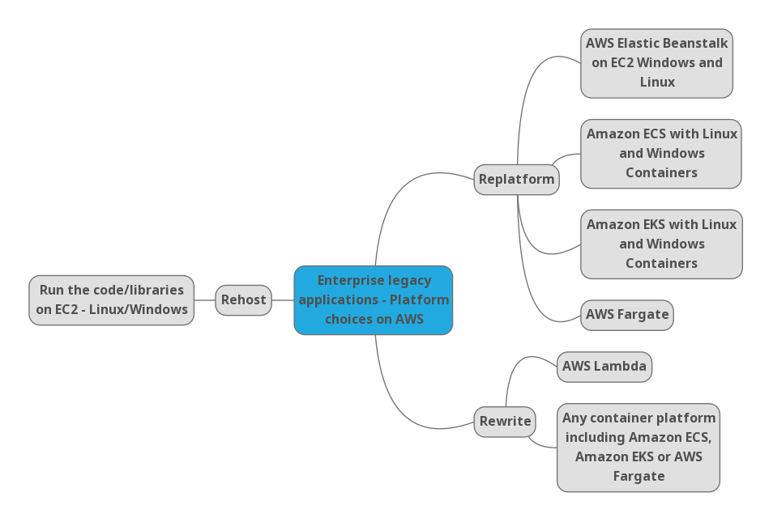

This directory contains some general guidelines for migrating Microsoft and Java technology based apps to AWS. Applications which use other technologues like Python, Node JS, Go, Ruby etc. will involve similar migration strategies. 

A mindmap of the various options for migrating "legacy" applications to AWS

